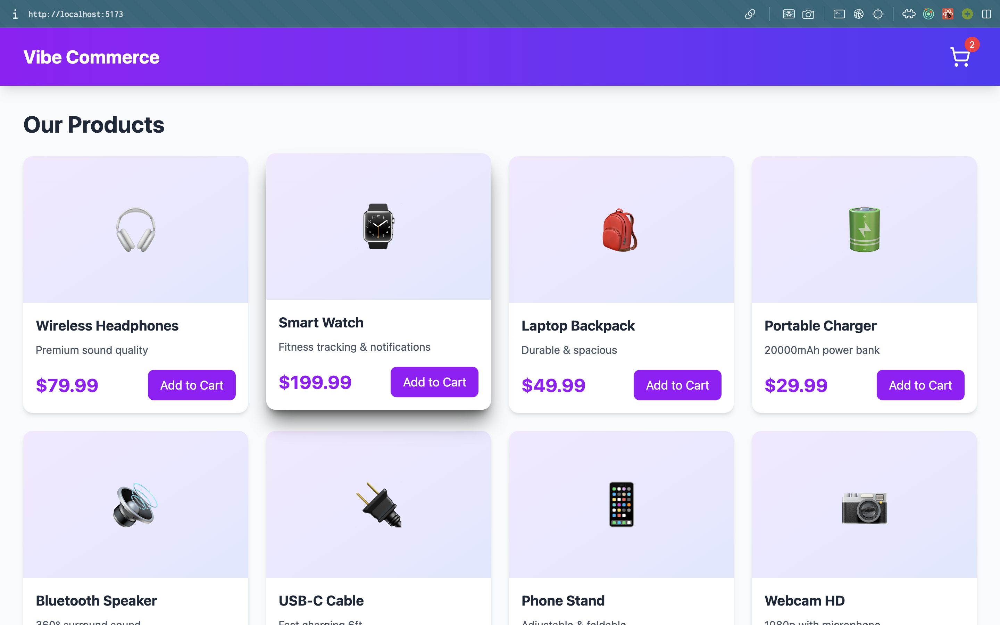
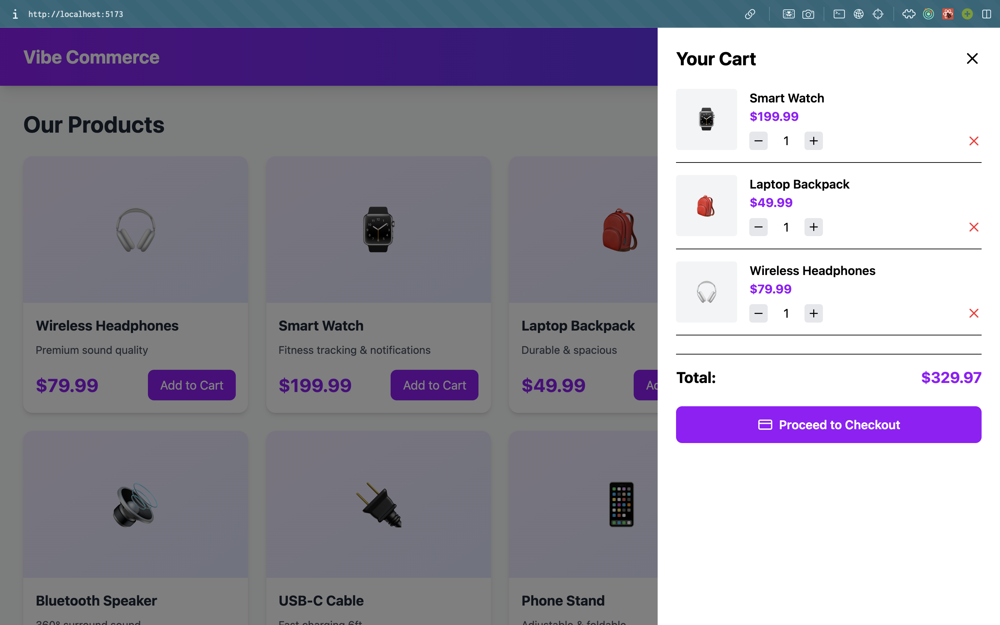
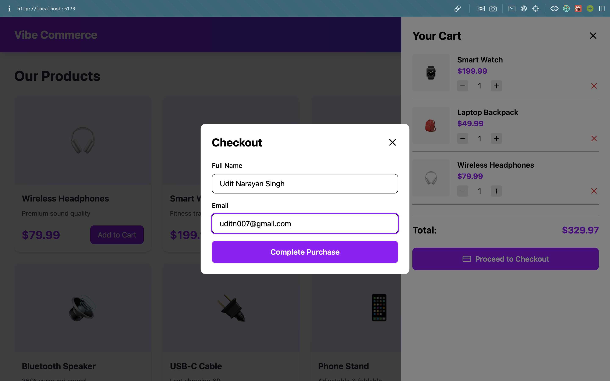
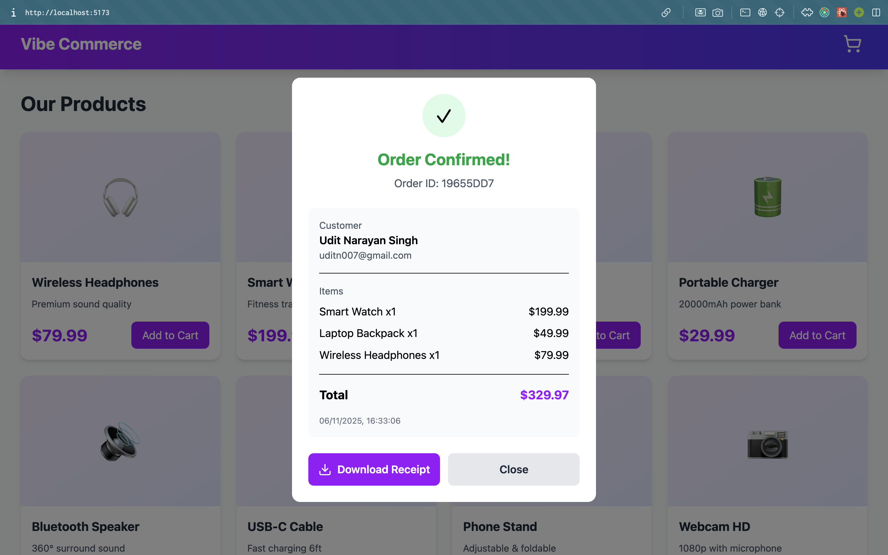

# Vibe Commerce - Full Stack E-Commerce Cart

A modern, full-stack shopping cart application built for Nexora screening assignment. Features include product browsing, cart management, checkout process, and downloadable purchase receipts.

## 🚀 Features

### Backend
- RESTful API with Express.js
- MongoDB database integration
- Mock product inventory (10 items)
- Cart management (add, update, remove items)
- Checkout with order processing
- Automatic cart clearing after purchase

### Frontend
- React with Redux state management
- Tailwind CSS for responsive design
- Axios for API calls 
- Real-time cart updates
- Modal-based checkout form
- Downloadable purchase receipt (text file)
- Error handling and loading states

## 📁 Project Structure

```
vibecommerce/
│
├── README.md
│
├── backend/
│   ├── .env
│   ├── .gitignore
│   ├── package.json
│   ├── package-lock.json
│   └── src/
|       ├── server.js
│       ├── routes/
│       │   ├── cart.js
│       │   ├── checkout.js
│       │   └── product.js
│       ├── models/
│       │   ├── cartItem.js
│       │   ├── order.js
│       │   └── product.js
│       └── config/
│           └── database.js
│
├── frontend/
│   ├── .gitignore
│   ├── package.json
│   ├── tailwind.config.js
│   ├── postcss.config.js
│   ├── public/
│   │   └── index.html
│   └── src/
│       ├── App.jsx
│       ├── index.js
│       ├── index.css
│       ├── components/
│       │   ├── ProductGrid.jsx
│       │   ├── CartSidebar.jsx
│       │   ├── CheckoutForm.jsx
│       │   └── ReceiptModal.jsx
│       |── store/
│           ├── store.js
│           └── cartSlice.js
│
└── screenshots/
    ├── products.png
    ├── cart.png
    ├── checkout.png
    ├── receipt.png
    └── Vibe_Commerce_Receipt.txt
```

## 🛠️ Tech Stack

**Frontend:**
- React 18
- Redux Toolkit
- Axios
- Tailwind CSS
- Lucide React (icons)

**Backend:**
- Node.js
- Express.js
- MongoDB + Mongoose
- CORS
- UUID
- DOTENV

## 📋 Prerequisites

- Node.js (v16 or higher)
- MongoDB (local or Atlas)
- npm or yarn

## ⚙️ Setup Instructions

### 1. Clone the Repository

```bash
git clone https://github.com/UditNS/Vibe-Commerce.git
cd Vibe-Commerce
```

### 2. Backend Setup

```bash
cd backend
npm install
```
**Create a .env file**
- .env contains DATABASE_URL & PORT

**Configure MongoDB:**
- If using local MongoDB, ensure it's running on `mongodb://localhost:27017`
- If using MongoDB Atlas, update the connection string in `.env`:


**Start the backend server:**

```bash
npm run start
# Or for development with auto-reload:
npm run dev
```

Server will run on `http://localhost:4000`

### 3. Frontend Setup

```bash
cd frontend
npm install
```

**Start the development server:**

```bash
npm run dev
```

Frontend will run on `http://localhost:5173`

## 🔌 API Endpoints

| Method | Endpoint | Description |
|--------|----------|-------------|
| GET | `/api/products` | Get all products |
| GET | `/api/cart` | Get cart items and total |
| POST | `/api/cart` | Add item to cart |
| PUT | `/api/cart/:id` | Update item quantity |
| DELETE | `/api/cart/:id` | Remove item from cart |
| POST | `/api/checkout` | Process checkout |

### API Examples

**Add to Cart:**
```json
POST /api/cart
{
  "productId": "64f3a...",
  "qty": 1
}
```

**Checkout:**
```json
POST /api/checkout
{
  "name": "John Doe",
  "email": "john@example.com",
  "cartItems": [...]
}
```

## 🎨 Features Walkthrough

### 1. Product Grid
- Displays 10 mock products with names, descriptions, prices, and emojis
- Responsive grid layout (1-4 columns based on screen size)
- Hover effects for better UX

### 2. Shopping Cart
- Slide-in sidebar showing cart items
- Real-time total calculation
- Quantity adjustment (+ / - buttons)
- Remove items functionality
- Badge showing cart item count

### 3. Checkout Process
- Modal form for customer details (name & email)
- Form validation
- Loading states during processing

### 4. Purchase Receipt
- Success modal with order confirmation
- Order ID generation (UUID)
- Itemized receipt display
- Downloadable text file receipt
- Timestamp of purchase

## 📸 Screenshots

### Product Grid


### Shopping Cart


### Checkout Form


### Receipt


## ✨ Bonus Features Implemented

- ✅ MongoDB database persistence
- ✅ Error handling (frontend & backend)
- ✅ Loading states
- ✅ Responsive design
- ✅ Mock user system
- ✅ Downloadable receipts
- ✅ Auto-seeding of products
- ✅ Order history storage in Mongodb

## 🚧 Future Enhancements

- User authentication
- Product search/filter
- Payment gateway integration
- Order history page
- Admin dashboard
- Product reviews
- Inventory management

## 🐛 Troubleshooting

**MongoDB Connection Error:**
- Ensure MongoDB is running
- Check connection string in `server.js`
- For Atlas, whitelist your IP address

**CORS Error:**
- Verify backend is running on port 4000
- Check API_URL in `App.jsx` matches backend


## 👤 Author

Udit Narayan Singh - Vibe Commerce Screening Assignment
